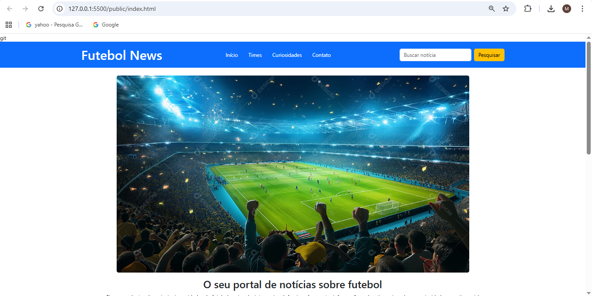
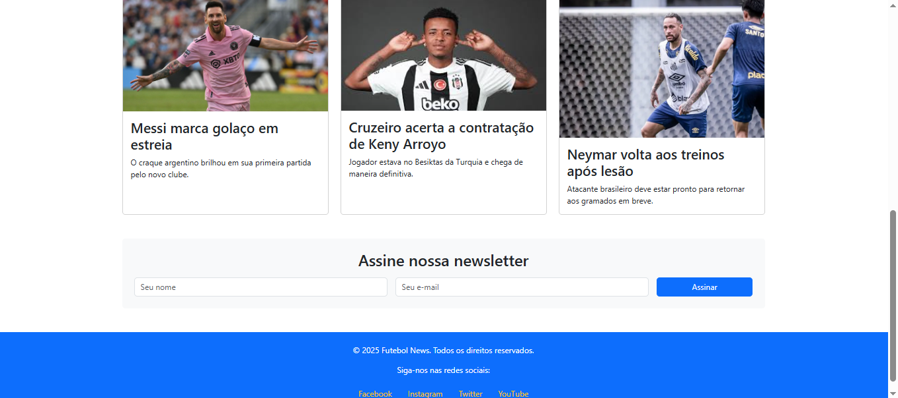
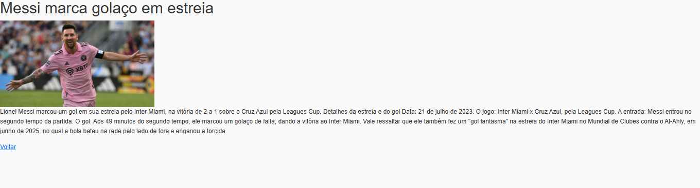

# Trabalho Prático 05 - Semanas 7 e 8

**Páginas de detalhes dinâmicas**

Nessa etapa, vamos evoluir o trabalho anterior, acrescentando a página de detalhes, conforme o  projeto escolhido. Imagine que a página principal (home-page) mostre um visão dos vários itens que existem no seu site. Ao clicar em um item, você é direcionado pra a página de detalhes. A página de detalhe vai mostrar todas as informações sobre o item do seu projeto. seja esse item uma notícia, filme, receita, lugar turístico ou evento.

Leia o enunciado completo no Canvas. 

**IMPORTANTE:** Assim como informado anteriormente, capriche na etapa pois você vai precisar dessa parte para as próximas semanas. 

**IMPORTANTE:** Você deve trabalhar e alterar apenas arquivos dentro da pasta **`public`,** mantendo os arquivos **`index.html`**, **`styles.css`** e **`app.js`** com estes nomes, conforme enunciado. Deixe todos os demais arquivos e pastas desse repositório inalterados. **PRESTE MUITA ATENÇÃO NISSO.**

## Informações Gerais

- Nome: Matheus Dias
- Matricula: 877215
- Proposta de projeto escolhida: 3. Organizações e Equipes
- Breve descrição sobre seu projeto: Site de notícias e curiosidades sobre o mundo do futebol,relacionado a times e atletas desse meio.

## Print da Home-Page

<< >>
<< >>

## Print da página de detalhes do item

<< >>

## Cole aqui abaixo a estrutura JSON utilizada no app.js

 [{
    id: 1,
    titulo: "Messi marca golaço em estreia",
    imagem: "images/messi_gol.png",
    resumo: "O craque argentino brilhou em sua primeira partida pelo novo clube.",
    conteudo: `Lionel Messi marcou um gol em sua estreia pelo Inter Miami, na vitória de 2 a 1 sobre o Cruz Azul pela Leagues Cup. 
Detalhes da estreia e do gol
Data: 21 de julho de 2023.
O jogo: Inter Miami x Cruz Azul, pela Leagues Cup.
A entrada: Messi entrou no segundo tempo da partida.
O gol: Aos 49 minutos do segundo tempo, ele marcou um golaço de falta, dando a vitória ao Inter Miami. 
Vale ressaltar que ele também fez um "gol fantasma" na estreia do Inter Miami no Mundial de Clubes contra o Al-Ahly, em junho de 2025, no qual a bola bateu na rede pelo lado de fora e enganou a torcida`
  },
  {
    id: 2,
    titulo: "Cruzeiro contrata Keny Arroyo",
    imagem: "images/cruzeiro_Keny.png",
    resumo: "Atacante colombiano chega para reforçar o elenco celeste.",
    conteudo: `O Cruzeiro confirmou a contratação do equatoriano Keny Arroyo em setembro de 2025, em um acordo que custou mais de 8 milhões de euros (aproximadamente R$ 50,7 milhões) e garantiu ao clube 50% dos direitos econômicos do jogador, com a outra metade pertencendo ao Independiente del Valle. O atacante de 19 anos, que também já atuou pela seleção equatoriana, assinou contrato com o time mineiro até o fim de 2029,
    Detalhes da negociação: O Cruzeiro desembolsou mais de 8 milhões de euros (ou R$ 50,7 milhões) pelo jogador, que foi negociado com o clube turco Besiktas.
     O acordo estabeleceu que o Cruzeiro adquiriu 50% dos direitos econômicos de Keny Arroyo, enquanto o Independiente del Valle manteve a outra metade.`
  },
  {
    id: 3,
    titulo: "Neymar volta aos treinos após lesão",
    imagem: "images/neymar_treino.jpg",
    resumo: "O atacante brasileiro deve retornar aos gramados em breve.",
    conteudo: `Neymar está em fase de recuperação de uma nova lesão muscular na coxa direita. A previsão é que ele retorne aos gramados somente em novembro, na reta final do Campeonato Brasileiro. 
Detalhes da Lesão e Recuperação
Data da lesão mais recente: Metade de setembro de 2025.
Tipo de lesão: Ruptura do músculo da coxa direita.
Tempo de recuperação estimado: Semanas, podendo durar até novembro, segundo o presidente do Santos, Marcelo Teixeira. O retorno na reta final do Brasileirão é a meta. `
  }
]
