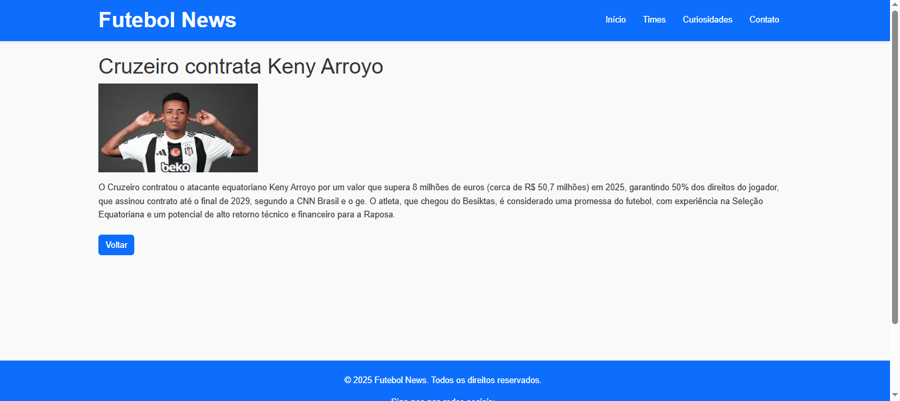

# Trabalho Prático 05 - Semanas 7 e 8

**Páginas de detalhes dinâmicas**

Nessa etapa, vamos evoluir o trabalho anterior, acrescentando a página de detalhes, conforme o  projeto escolhido. Imagine que a página principal (home-page) mostre um visão dos vários itens que existem no seu site. Ao clicar em um item, você é direcionado pra a página de detalhes. A página de detalhe vai mostrar todas as informações sobre o item do seu projeto. seja esse item uma notícia, filme, receita, lugar turístico ou evento.

Leia o enunciado completo no Canvas. 

**IMPORTANTE:** Assim como informado anteriormente, capriche na etapa pois você vai precisar dessa parte para as próximas semanas. 

**IMPORTANTE:** Você deve trabalhar e alterar apenas arquivos dentro da pasta **`public`,** mantendo os arquivos **`index.html`**, **`styles.css`** e **`app.js`** com estes nomes, conforme enunciado. Deixe todos os demais arquivos e pastas desse repositório inalterados. **PRESTE MUITA ATENÇÃO NISSO.**

## Informações Gerais

- Nome: Matheus Dias
- Matricula: 877215
- Proposta de projeto escolhida: 3. Organizações e Equipes
- Breve descrição sobre seu projeto: Site de notícias e curiosidades sobre o mundo do futebol,relacionado a times e atletas desse meio.

## Print da Home-Page

<< >>
<< >>

## Print da página de detalhes do item

<< >>

## Cole aqui abaixo a estrutura JSON utilizada no app.js

[
  {
    id: 1,
    titulo: "Messi marca golaço em estreia",
    imagem: "images/messi_gol.png",
    resumo: "O craque argentino brilhou em sua primeira partida pelo novo clube.",
    conteudo: `Lionel Messi marcou um gol em sua estreia pelo Inter Miami, na vitória de 2 a 1 sobre o Cruz Azul pela Leagues Cup. 
Detalhes da estreia e do gol
Data: 21 de julho de 2023.
O jogo: Inter Miami x Cruz Azul, pela Leagues Cup.
A entrada: Messi entrou no segundo tempo da partida.
O gol: Aos 49 minutos do segundo tempo, ele marcou um golaço de falta, dando a vitória ao Inter Miami. 
Vale ressaltar que ele também fez um "gol fantasma" na estreia do Inter Miami no Mundial de Clubes contra o Al-Ahly, em junho de 2025, no qual a bola bateu na rede pelo lado de fora e enganou a torcida.`
  },
  {
    id: 2,
    titulo: "Cruzeiro contrata Keny Arroyo",
    imagem: "images/cruzeiro_Keny.png",
    resumo: "Atacante colombiano chega para reforçar o elenco celeste.",
    conteudo: `O Cruzeiro contratou o atacante equatoriano Keny Arroyo por um valor que supera 8 milhões de euros (cerca de R$ 50,7 milhões) em 2025, garantindo 50% dos direitos do jogador, que assinou contrato até o final de 2029, segundo a CNN Brasil e o ge. O atleta, que chegou do Besiktas, é considerado uma promessa do futebol, com experiência na Seleção Equatoriana e um potencial de alto retorno técnico e financeiro para a Raposa.`
  },
  {
    id: 3,
    titulo: "Neymar volta aos treinos após lesão",
    imagem: "images/neymar_treino.jpg",
    resumo: "O atacante brasileiro deve retornar aos gramados em breve.",
    conteudo: `A previsão é que o atacante retorne aos gramados somente nas últimas rodadas do Campeonato Brasileiro de 2025, o que significa que ele não estará disponível antes de novembro. Segundo o presidente do Santos, Marcelo Teixeira, Neymar deve voltar em um mês.`
  }
];
